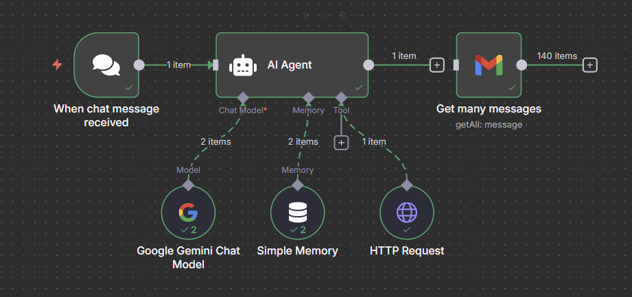

# My Web Scrapper

A simple web scraping project to extract and process data from websites. This repository contains the configuration file `my Web-scrapper.json` and the main code for scraping.

## Features
- Easy configuration using JSON
- Customizable scraping logic
- Designed for extensibility

## Getting Started
1. Clone the repository:
   ```sh
   git clone https://github.com/uzicodes/my-Web-scrapper.git
   ```
2. Add your configuration to `my Web-scrapper.json`.
3. Run the scraper according to your setup.

## Screenshot
Below is a screenshot of the application in action:

## Contributing
Feel free to fork the repo and submit pull requests for improvements or bug fixes.


